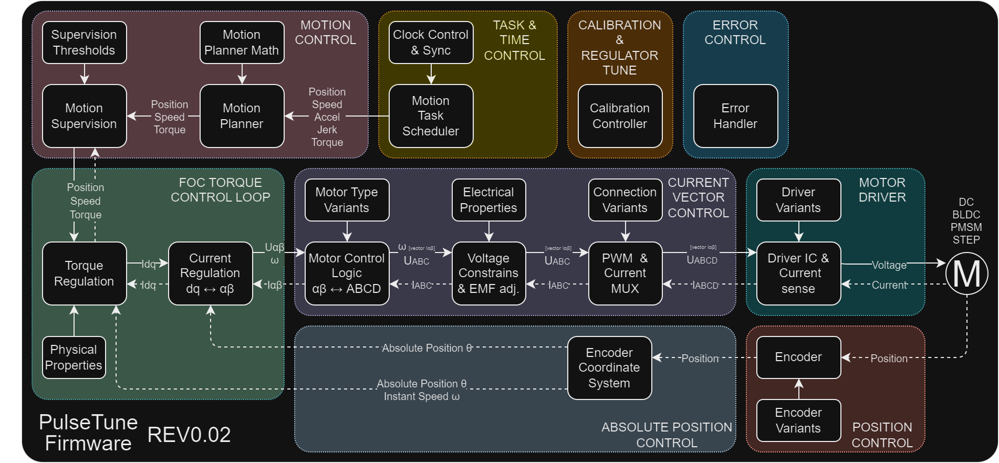
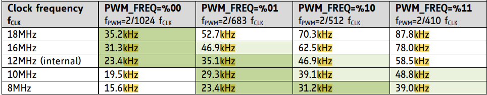

# TunePulse Firmware

[](https://github.com/creapunk/TunePulse/blob/main/LICENSE) 
[](https://platformio.org/)
[](https://discord.gg/V4aJdTja8v)
[](https://ko-fi.com/creapunk)

**TunePulse** is an upcoming open-source firmware designed to:

- Control a wide range of motors (DC, Stepper, BLDC, PMSM, Linear)
- Support various control modes (Closed-loop, FOC, Position, Speed, Torque, etc.)
- Feature compatibility with multiple interfaces (Step-Dir, UART, I2C, CAN/CAN-FD, USB)
- Support various protocols (GCODE, Klipper, etc.)

Its primary goal is to advance the development of closed-loop systems and simplify their integration into existing setups.

> **Note: This firmware is under heavy development and currently lacks documentation.
> For more information, join the Creapunk community on [Discord](https://discord.gg/V4aJdTja8v).**

## Structure

### Architecture Key Points

#### 1. Low Level Based on Integer Math

Since control systems on digital platforms are inherently discrete, it makes sense to base frequent low-level computations on integer math. This provides a computational speed boost because:

- Floating-point math requires an FPU; otherwise, operations are nearly 100 times slower.
- Using integer math avoids unnecessary conversions from FLOAT to INTEGER when interacting with microcontroller peripherals (Timers, ADC, DAC).

#### 2. Intermodule Communication



To facilitate interaction between different parts of the system, a method similar to software DMA (swDMA) will be employed. The code will be divided into several functional modules, with their input and output data globally visible (global variables - referred to as data channels). Multiple modules can access the same data channels. This approach allows for flexible customization, unlimited functional expansion, and strict real-time event adherence.

General Rules:

1. Each computational module is a class with pointers to input data channels and pointers to output data channels.
2. Each module has at least three parts: Read Callback, Run Callback, and Write Callback. The priority of Read and Write interrupts is the same, while Run's priority is lower. Run priorities for different modules are chosen based on the module's tasks.
3. The priority of callbacks working with the same data channel (whether reading or writing) must be the same.
4. All data channels must be within a namespace to enhance code safety.

Three Groups of Data Channels:

1. Low-level data channels for peripheral interaction. Exclusively integer types for increased speed.

|    Group     |        Variable         |        Unit         |  Type   |       Range        |
| :----------: | :---------------------: | :-----------------: | :-----: | :----------------: |
| Voltage ABCD | V_CH1 V_CH2 V_CH3 V_CH4 |          ?          | int32_t |        full        |
| Current ABCD | I_CH1 I_CH2 I_CH3 I_CH4 |         mA          | int32_t | [-500000, +500000] |
| Sys Voltage  |       V_SUP V_REF       |         mV          | int32_t |   [0, +1000000]    |
|    Angle     |          ANGLE          | [one full rotation] | int32_t |        full        |
|   Rotation   |        ROTATION         |  [rotation count]   | int32_t |        full        |

2. Intermediate data channels for main controller operation. Predominantly float for solution flexibility.

|    Group     |   Variable    |          Unit           | Type  |         Range          |
| :----------: | :-----------: | :---------------------: | :---: | :--------------------: |
|  Voltage αβ  |    V_A V_B    |            V            | float |   [-1000.0, +1000.0]   |
|  Current αβ  |    I_A I_B    |            A            | float |   [-1000.0, +1000.0]   |
|  Voltage dq  |    V_D V_Q    |            V            | float |   [-1000.0, +1000.0]   |
|  Current dq  |    I_D I_Q    |            A            | float |   [-1000.0, +1000.0]   |
|   Position   | INST_POSITION |   [absolute position]   | float |          full          |
|   Velocity   | INST_VELOCITY |       Rotations/s       | float |  [-25000.0, +25000.0]  |
| Acceleration |  INST_ACCEL   | Rotations/s<sup>2</sup> | float | [-100000.0, +100000.0] |
|    Torque    |  INST_TORQUE  |            ?            | float |          full          |

3. High-level data channels for target values for controllers.

|    Group     |   Variable    |          Unit           | Type  |         Range          |
| :----------: | :-----------: | :---------------------: | :---: | :--------------------: |
|   Position   | TRGT_POSITION |   [absolute position]   | float |          full          |
|   Velocity   | TRGT_VELOCITY |       Rotations/s       | float |  [-25000.0, +25000.0]  |
| Acceleration |  TRGT_ACCEL   | Rotations/s<sup>2</sup> | float | [-100000.0, +100000.0] |
|    Torque    |  TRGT_TORQUE  |            ?            | float |          full          |

### 3. Timing and Synchronization

To optimize calculations and synchronize actions of different controllers (PWM, Current, Position, FOC, etc.), it is necessary to set integer ratios between the PWM frequency and the update frequencies for position/FOC.

#### PWM

Referencing the TMC5160 documentation reveals optimal PWM frequencies.



For example, increasing the PWM frequency affects:

- Increased heat dissipation during switching
- Reduced PWM resolution
- Reduced current ripple

Very low PWM frequencies can cause significant acoustic noise. To avoid this, a PWM frequency of ≥20kHz is optimal.

Using high voltages ≥36V also necessitates a higher PWM frequency to reduce current ripple, optimally ≥25kHz.

#### Current Control

The current regulator and PWM duty cycle can operate at the PWM frequency or at a lower multiple. Optimally, current control should operate at frequencies ≥15kHz.

#### Position Control

The maximum position control frequency is limited by the position sensor. For I2C or SPI encoders, this typically ranges from a few kHz to several tens of kHz.

ABZ optical encoders usually operate at higher frequencies.

#### FOC Control

It does not make sense to perform FOC control at frequencies higher than Current and Position control.

For high inertia systems, a few kHz is sufficient, while highly dynamic applications require higher update frequencies, >10kHz.

Too high a frequency can consume all the microcontroller's resources.

#### Summary

| Discretization:  |   Min   |    Optimum     |                       Max                        |
| :--------------- | :-----: | :------------: | :----------------------------------------------: |
| PWM control ≥36V |  25kHz  |     40kHz      |                      55kHz                       |
| PWM control <36V |  20kHz  |     35kHz      |                      50kHz                       |
| Current control  |  10kHz  | F<sub>PWM</sub> |                   F<sub>PWM</sub>                 |
| Position Control |   5kHz  |     20kHz      |                   F<sub>ENC</sub>                 |
| FOC Control      |   5kHz  |     15kHz      | MIN(F<sub>ENC</sub>, F<sub>ISENS</sub>)          |

#### Reference Values for CLN17 V2

| Discretization:  | Frequency |          Time Base           | Period | Cycles |
| :--------------- | :-------: | :--------------------------: | :----: | :----: |
| MCU core clock   | 170MHz    | 1 / (170 * 10<sup>6</sup>) s | 5.8ns  |   1    |
| PWM & Current    |  32kHz    | 1 / (32 * 10<sup>3</sup>) s  | 31.2us |  5312  |
| Position & FOC   |  16kHz    | 1 / (16 * 10<sup>3</sup>) s  | 62.5us | 10624  |

## Setup

> The documentation will be updated

### Target Defines

For specific targets:

```c
#define TARGET_CLN17_V1_5 // CLN17 v1.5
#define TARGET_CLN17_V2 // CLN17 v2
```

For specific features:

```c
// #define FEATURE_CANFD # CAN FD communication
```
